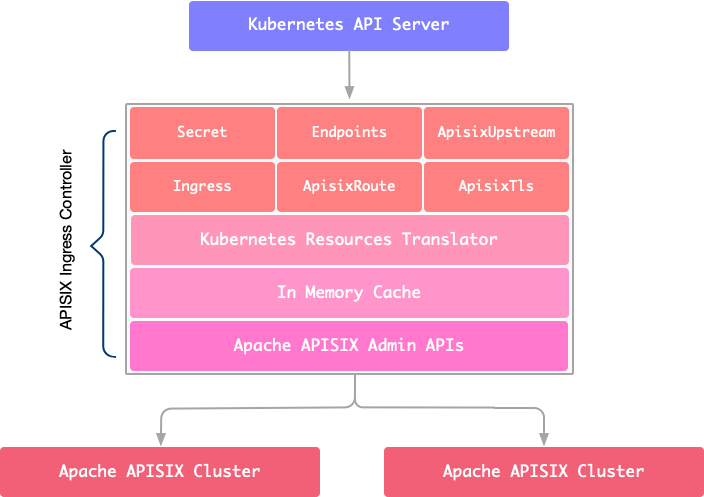

<!--
#
# Licensed to the Apache Software Foundation (ASF) under one or more
# contributor license agreements.  See the NOTICE file distributed with
# this work for additional information regarding copyright ownership.
# The ASF licenses this file to You under the Apache License, Version 2.0
# (the "License"); you may not use this file except in compliance with
# the License.  You may obtain a copy of the License at
#
#     http://www.apache.org/licenses/LICENSE-2.0
#
# Unless required by applicable law or agreed to in writing, software
# distributed under the License is distributed on an "AS IS" BASIS,
# WITHOUT WARRANTIES OR CONDITIONS OF ANY KIND, either express or implied.
# See the License for the specific language governing permissions and
# limitations under the License.
#
-->

# API7 Ingress Controller

All configurations in `api7-ingress-controller` are defined with Kubernetes CRDs (Custom Resource Definitions).
Support configuring [plugins](https://github.com/apache/apisix/blob/master/docs/en/latest/plugins), service registration discovery mechanism for upstreams, load balancing and more in Apache APISIX.

`api7-ingress-controller` is an Apache APISIX control plane component. Currently it serves for Kubernetes clusters. In the future, we plan to separate the submodule to adapt to more deployment modes, such as virtual machine clusters.

The technical architecture of `api7-ingress-controller`:

## Status

This project is currently general availability.

## Features

* Declarative configuration for Apache APISIX with Custom Resource Definitions(CRDs), using k8s yaml struct with minimum learning curve.
* Hot-reload during yaml apply.
* Native Kubernetes Ingress (both `v1` and `v1beta1`) support.
* Auto register k8s endpoint to upstream (Apache APISIX) node.
* Support load balancing based on pod (upstream nodes).
* Out of box support for node health check.
* Plug-in extension supports hot configuration and immediate effect.
* Support SSL and mTLS for routes.
* Support traffic split and canary deployments.
* Support TCP 4 layer proxy.
* Ingress controller itself as a pluggable hot-reload component.
* Multi-cluster configuration distribution.

[More about comparison among multiple Ingress Controllers.](https://docs.google.com/spreadsheets/d/191WWNpjJ2za6-nbG4ZoUMXMpUK8KlCIosvQB0f-oq3k/edit?ts=5fd6c769#gid=907731238)

## Get started

* [How to install](./install.md)
* [Get Started](./docs/en/latest/getting-started.md)
* [Design introduction](./docs/en/latest/design.md)
* [FAQ](./docs/en/latest/FAQ.md)

## Prerequisites

Apisix ingress controller requires Kubernetes version 1.16+. Because we used `CustomResourceDefinition` v1 stable API.
From the version 1.0.0, APISIX-ingress-controller need to work with Apache APISIX version 2.7+.

## Works with APISIX Dashboard

Currently, APISIX Ingress Controller automatically manipulates some APISIX resources, which is not very compatible with APISIX Dashboard. In addition, users should not modify resources labeled `managed-by: api7-ingress-controllers` via APISIX Dashboard.

## Internal Architecture

## Apache APISIX Ingress vs. Kubernetes Ingress Nginx

* The control plane and data plane are separated, which can improve security and deployment flexibility.
* Hot-reload during yaml apply.
* [More convenient canary deployment.](./docs/en/latest/concepts/apisix_route.md)
* Verify the correctness of the configuration, safe and reliable.
* [Rich plugins and ecology.](https://github.com/apache/apisix/tree/master/docs/en/latest/plugins)
* Supports APISIX custom resources and Kubernetes native Ingress resources.

* APISIX Ingress: the whole service that contains the proxy ([Apache APISIX](https://apisix.apache.org)) and ingress controller (api7-ingress-controller).
* api7-ingress-controller: the ingress controller component.
