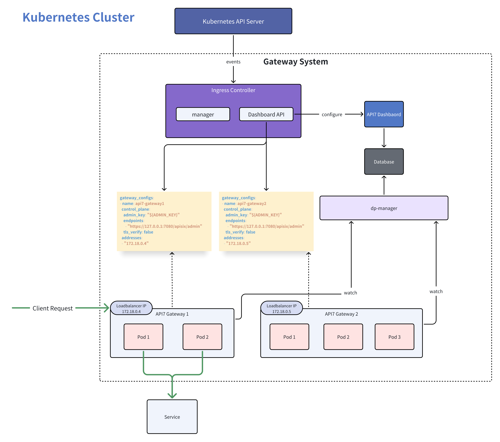

# Concepts

The API7 Ingress Controller is used to manage the API7 Gateway as either a standalone application or a Kubernetes-based application. It dynamically configures and manages the API7 Gateway using Gateway API resources.

## Architecture

## Kubernetes Resources

### Service

In Kubernetes, a Service is a method to expose network applications running on a set of Pods as network services.

When proxying ingress traffic, API7 Gateway by default directs traffic directly to the Pods instead of through kube-proxy.

### EndpointSlicea

EndpointSlice objects represent subsets (slices) of backend network endpoints for a Service.

The API7 Ingress Controller continuously tracks matching EndpointSlice objects, and whenever the set of Pods in a Service changes, the set of Pods proxied by the API7 Gateway will also update accordingly.

## Gateway API

Gateway API is an official Kubernetes project focused on L4 and L7 routing in Kubernetes. This project represents the next generation of Kubernetes Ingress, Load Balancing, and Service Mesh APIs.

For more information on supporting Gateway API, please refer to [Gateway API](./gateway-api.md).
